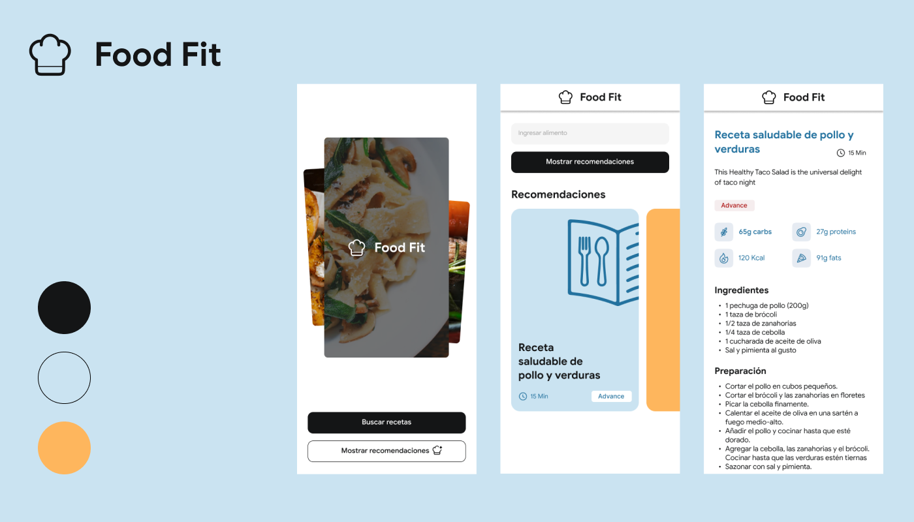

# Food Fit App in Genkit with Angular



This is a Food Fit demo that uses Firebase Genkit to generate healthy recipes. This project uses [Angular](https://angular.dev/) for the frontend and [Genkit](https://firebase.google.com/docs/genkit) deployed on [Cloud Functions](https://firebase.google.com/docs/functions). For more information on how this app was created, check out this [blog post](https://lperezp.medium.com/food-fit-tu-partner-para-tener-una-alimentaci%C3%B3n-saludable-con-genkit-140d7cd25a22).

# Installation

To set up the project, follow these steps:

## Main application

Go to the `food-fit-app` folder and run the following command:

```
cd food-fit-app
npm install
```

## Cloud Functions

Go to the server/functions folder and run the same command:

```
cd server/functions
npm install
```

# Usage

## Main application

Go to the `food-fit-app` folder and run the following command:

```
cd food-fit-app
ng serve
```

Navigate to `http://localhost:4200/`. The application will automatically reload if you change any of the source files.


## Cloud Functions

Follow the [guide](https://firebase.google.com/docs/genkit/cloud-run#make_api_credentials_available_to_deployed_flows) to generate the API KEY for deployment. Go to the server/functions folder and run the same command:

```
cd server/functions
npm run serve
```

# Run Genkit only

To run Genkit only, replace the `GOOGLE_GENAI_API_KEY` in the `.env` file and run the following command:

```
npm run genkit:dev
```

Generate an API key for the Gemini API using [Google AI Studio](https://aistudio.google.com/app/apikey).

# Contributing

[](https://github.com/lperezp/food-fit-app/pulls)

I welcome all contributions. Please read our [CONTRIBUTING.md](https://github.com/lperezp/food-fit-app/blob/master/CONTRIBUTING.md) first. You can submit any ideas as [pull requests](https://github.com/lperezp/food-fit-app/pulls) or as [GitHub issues](https://github.com/lperezp/food-fit-app/issues).

# Author

- [Luis Eduardo](https://lperezp.dev/?utm_source=food-fit-app&utm_medium=readme&utm_campaign=food-fit-app&utm_id=github)

**Love food-fit-app? Give our repo a star :star: :arrow_up:.**