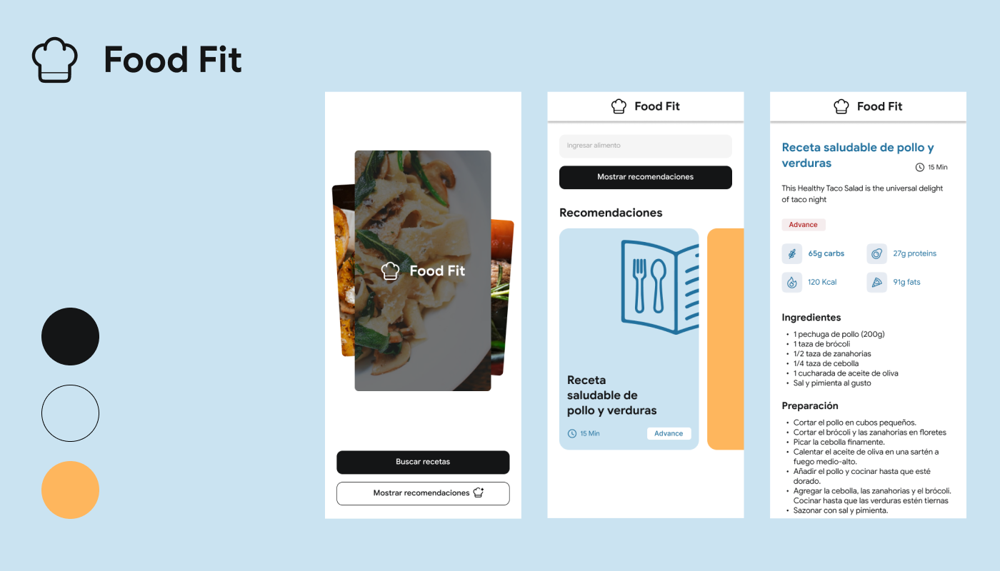

# Food Fit App powered by Firebase Genkit 🤖✨



**Food Fit** is an intelligent recipe generation application that showcases the power of **Firebase Genkit** for building AI-powered applications. This project demonstrates advanced AI workflows using **Google's Gemini models** for recipe generation and **Imagen** for food photography, all orchestrated through Genkit's powerful flow system.

Built with [Angular](https://angular.dev/) for the frontend and [Firebase Genkit](https://firebase.google.com/docs/genkit) deployed on [Cloud Functions](https://firebase.google.com/docs/functions), this application represents a complete AI-powered food recommendation system.

📖 **Learn More**: Check out this [detailed blog post](https://lperezp.medium.com/food-fit-tu-partner-para-tener-una-alimentaci%C3%B3n-saludable-con-genkit-140d7cd25a22) about the development process.

## 🤖 Firebase Genkit Integration

### Core AI Capabilities
This application showcases **Firebase Genkit**'s powerful AI orchestration capabilities through multiple specialized flows:

#### 🧠 **Intelligent Recipe Generation Flows**
- **`foodSuggestionFlow`**: Base recipe generation using Gemini 2.0 Flash
- **`foodSuggestionWithProhibitedFoodFlow`**: Advanced flow with user allergy/restriction awareness
- **`listFoodsSuggestionFlow`**: Bulk recipe recommendations
- **`generateImageFoodFlow`**: AI-powered food photography using Google's Imagen model

#### 🛡️ **Smart Safety & Personalization**
- **Allergy-Aware AI**: Automatic exclusion of prohibited ingredients from recipes
- **Context-Aware Prompting**: Dynamic system prompts based on user dietary restrictions
- **Structured Output**: Type-safe recipe generation with Zod schema validation
- **Temperature Control**: Optimized model parameters for consistent, safe outputs

#### 🔧 **Technical Implementation**
- **Multi-Model Architecture**: Combines Gemini 2.0 Flash (text) + Imagen 3 (images)
- **Vertex AI Integration**: Enterprise-grade AI model access through Google Cloud
- **Firebase Telemetry**: Built-in monitoring and observability
- **Cloud Functions Deployment**: Serverless scaling with automatic HTTPS endpoints
- **CORS Support**: Cross-origin requests for seamless frontend integration

#### 📊 **Structured Data Output**
```typescript
// Example recipe schema generated by Genkit
{
  name: string,
  description: string,
  ingredients: string[],
  nutritional_information: {
    cal: number,
    carbohydrates: number,
    fats: number,
    sodium: number,
    cholesterol: number,
    proteins: number
  },
  preparation_time: string,
  level: string,
  preparation: string[]
}
```

### 🚀 **Genkit Flow Architecture**
1. **Input Validation**: Type-safe input schemas with Zod
2. **Context Building**: Dynamic prompt construction with user preferences
3. **AI Generation**: Multi-model orchestration (Gemini + Imagen)
4. **Output Validation**: Structured response validation
5. **Error Handling**: Graceful failure management
6. **Telemetry**: Automatic performance and usage tracking

## ✨ New Features

## ✨ New Features

### 🔐 Authentication System
- **Google OAuth Integration**: Users can now sign in with their Google accounts
- **User Session Management**: Persistent authentication state across app sessions
- **Secure Logout**: Clean session termination functionality

### 🚫 Prohibited Foods Management
- **Personal Food Restrictions**: Users can add and manage their personal list of prohibited foods
- **Real-time Updates**: Add or remove prohibited foods with instant UI updates
- **User-specific Storage**: Each user's prohibited foods are stored securely in Firestore
- **Smart Validation**: Prevents duplicate entries and validates food inputs

### 🔥 Firebase Integration
- **Firestore Database**: Robust cloud database for storing user data and preferences
- **Firebase Authentication**: Secure user authentication with Google provider
- **Real-time Data Sync**: Automatic synchronization of user data across devices

## Project Structure

```
food-fit/
├── food-fit-app/        # Angular frontend application
│   ├── public/          # Static assets
│   └── src/             # Source code
│       ├── app/         # Angular components
│       │   ├── components/  # Reusable components
│       │   ├── pages/       # Page components
│       │   └── services/    # Angular services
│       └── ...
└── server/              # Backend server code
    └── functions/       # Cloud Functions
        ├── lib/         # Compiled JavaScript
        └── src/         # TypeScript source
            └── schemas/ # API schemas
```

### Main Components

- **food-fit-app**: Angular application with the user interface
  - **components**: Reusable UI components like headers
  - **pages**: Main application pages (home, search, food list, details, filter)
  - **services**: Data and API services
    - **auth**: Google authentication service
    - **firestore**: Firestore database operations
    - **food**: Food data management
    - **prohibited-food**: User-specific prohibited foods management

- **server/functions**: **Firebase Genkit AI Engine**
  - **4 Specialized AI Flows**: Recipe generation, image creation, and personalized recommendations
  - **Multi-Model Integration**: Gemini 2.0 Flash + Imagen 3
  - **schemas**: Type-safe Zod schemas for AI input/output validation
  - **Intelligent Prompting**: Context-aware system prompts with safety controls
  - **Vertex AI Backend**: Enterprise-grade Google Cloud AI infrastructure

## Installation

To set up the project, follow these steps:

### Prerequisites

- Node.js (v18 or higher)
- Angular CLI (`npm install -g @angular/cli`)
- Firebase CLI (`npm install -g firebase-tools`)

### Main Application

Navigate to the `food-fit-app` folder and run:

```
cd food-fit-app
npm install
```

### Cloud Functions

Navigate to the `server/functions` folder and run:

```
cd server/functions
npm install
```

### Firebase Configuration

1. Create a Firebase project at [Firebase Console](https://console.firebase.google.com/)
2. Enable Authentication with Google provider
3. Create a Firestore database
4. Update the Firebase configuration in `src/environments/environment.ts`

## Usage

### Main Application

Navigate to the `food-fit-app` folder and run:

```
cd food-fit-app
ng serve
```

Navigate to `http://localhost:4200/`. The application will automatically reload if you change any of the source files.

### Cloud Functions

Follow the [guide](https://firebase.google.com/docs/genkit/cloud-run#make_api_credentials_available_to_deployed_flows) to generate the API KEY for deployment. Navigate to the `server/functions` folder and run:

```
cd server/functions
npm run serve
```

## 🤖 Running Genkit Development Mode

Genkit provides a powerful development environment for testing and debugging AI flows:

### Prerequisites
1. Generate an API key for the Gemini API using [Google AI Studio](https://aistudio.google.com/app/apikey)
2. Create a `.env` file in `server/functions/` with:
   ```
   GOOGLE_GENAI_API_KEY=your_api_key_here
   ```

### Start Genkit Dev UI
```bash
cd server/functions
npm run genkit:dev
```

This launches the **Genkit Developer UI** where you can:
- 🧪 **Test AI Flows**: Interactive testing of all recipe generation flows
- 📊 **Monitor Performance**: Real-time flow execution metrics
- 🔍 **Debug Prompts**: Inspect and modify AI prompts in real-time
- 📈 **View Telemetry**: Comprehensive logging and tracing
- 🎯 **Schema Validation**: Test input/output schemas interactively
- 🔄 **Flow Visualization**: See the complete AI workflow execution

### Available Genkit Flows
- **foodSuggestionFlow**: Basic recipe generation
- **foodSuggestionWithProhibitedFoodFlow**: Allergy-aware recipes
- **listFoodsSuggestionFlow**: Multiple recipe suggestions
- **generateImageFoodFlow**: AI-generated food images

## Features Overview

### 📱 User Experience
- **Personalized Recommendations**: AI-powered recipe suggestions based on user preferences
- **Food Restriction Management**: Easy-to-use interface for managing dietary restrictions
- **Authenticated Experience**: Secure login with persistent user sessions
- **Responsive Design**: Optimized for both desktop and mobile devices

### 🔧 Technical Features
- **Firebase Genkit**: Complete AI application framework with flow orchestration
- **Multi-Model AI Pipeline**: Gemini 2.0 Flash (text) + Imagen 3 (images) integration
- **Vertex AI Platform**: Enterprise Google Cloud AI infrastructure
- **Type-Safe AI Workflows**: Zod schema validation for all AI inputs/outputs
- **Angular 18**: Modern frontend framework with standalone components
- **Firebase Suite**: Authentication, Firestore database, and Cloud Functions
- **Intelligent Prompting**: Dynamic, context-aware AI prompt generation

## Contributing

[](https://github.com/lperezp/food-fit-app/pulls)

All contributions are welcome! Please read our [CONTRIBUTING.md](CONTRIBUTING.md) for project guidelines. You can submit any ideas as [pull requests](https://github.com/lperezp/food-fit-app/pulls) or as [GitHub issues](https://github.com/lperezp/food-fit-app/issues).

If you want to contribute to the project, here are the basic steps:

1. Fork the repository
2. Create a feature branch (`git checkout -b feature/amazing-feature`)
3. Commit your changes (`git commit -m 'Add some amazing feature'`)
4. Push the branch (`git push origin feature/amazing-feature`)
5. Open a Pull Request

## License

This project is licensed under the [Apache License 2.0](LICENSE). You can use, modify, and distribute this code following the terms of the license.

## Author

- [Luis Eduardo](https://lperezp.dev/?utm_source=food-fit-app&utm_medium=readme&utm_campaign=food-fit-app&utm_id=github)

**Do you like food-fit-app? Give our repository a star :star: :arrow_up:.**