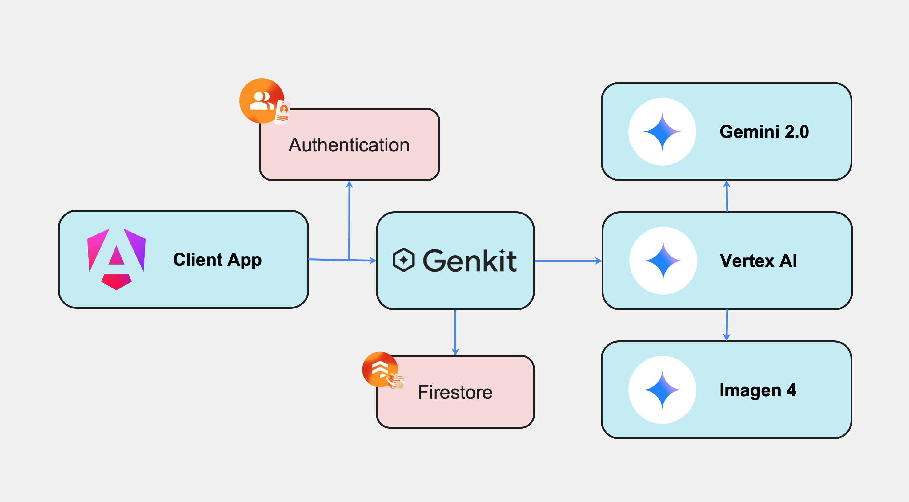
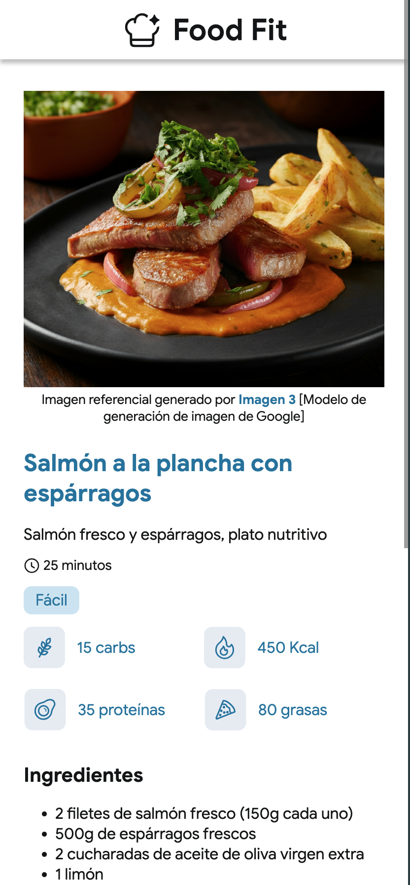
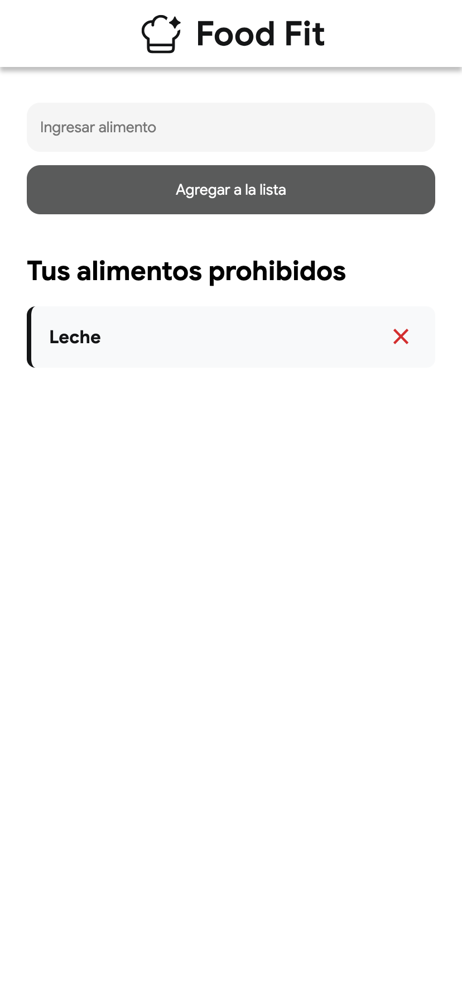

# Food Fit App powered by Firebase Genkit


**Food Fit** is an intelligent recipe generation and nutrition coaching application showcasing the power of **Firebase Genkit** for building state-of-the-art AI applications. The project demonstrates advanced AI workflows using **Google's Gemini models** for recipe recommendations, autonomous **Nutrition Coach AI agents** with dynamic tool calling, and **Gemini Flash Image** for realistic food photography, all orchestrated via Genkit's robust flow and agent ecosystem.

Built with [Angular 19](https://angular.dev/) for the frontend and [Firebase Genkit](https://firebase.google.com/docs/genkit) running on [Cloud Functions](https://firebase.google.com/docs/functions) (Node 22), this application represents an end-to-end, production-ready AI food assistant.

📖 **Learn More**: Check out the original [article](https://medium.com/@lperezp/food-fit-your-partner-for-healthy-eating-with-genkit-2cbd29702bd5) about the development process. If you wish to read it in Spanish, read this [article](https://lperezp.medium.com/food-fit-tu-partner-para-tener-una-alimentaci%C3%B3n-saludable-con-genkit-140d7cd25a22).

---

## 🏗️ Architecture & Firebase Genkit Integration



### 📸 Screenshots

| Recipe Generation | Prohibited Foods Management |
|:---:|:---:|
|  |  |

---

## ⚡ Core AI Capabilities

Food Fit leverages **Firebase Genkit**'s generative AI orchestration, beta Agent system, Dotprompt engine, and tool-calling capabilities:

### 1. Specialized Genkit Flows
- **`foodSuggestionFlow`**: Base recipe generation using Gemini 3.6 Flash tailored to requested ingredients and portion sizes.
- **`foodSuggestionWithProhibitedFoodFlow`**: Restriction-aware recipe flow that queries Firestore via `getProhibitedFoodsTool` to strictly exclude allergens and banned ingredients.
- **`listFoodsSuggestionFlow`**: Automated curated list of healthy recipes for daily meal planning.
- **`generateImageFoodFlow`**: Food photography generation using `googleai/gemini-3.1-flash-image`.
- **`nutritionCoachFlow`**: Interactive conversational flow routing user prompts to the autonomous Nutrition Coach agent.

### 2. Autonomous Nutrition Coach Agent & Tools
- **`nutritionCoachAgent` (`ai.defineAgent`)**: Interactive nutrition coach capable of conversing empathetically, gathering user context, and planning healthy meals while strictly enforcing dietary boundaries.
- **`getProhibitedFoods` (`ai.defineTool`)**: Reusable Genkit tool that queries Firestore in real-time by `userId` to retrieve user-specific allergies or excluded foods before recipes are suggested.

### 3. Smart Safety & Personalization
- **Context-Aware Safety**: Strict system instructions ensure that any prohibited foods or allergies are never included in recipe suggestions or coach responses.
- **Prompt Engineering with Dotprompt**: Modularized `.prompt` templates stored in `server/functions/prompts/` for maintainable schema definition and prompt versioning.
- **Structured Outputs**: Type-safe recipe outputs enforced by **Zod** schemas.
- **Deterministic Quality**: Fine-tuned temperature control for consistent, reliable culinary results.

### 4. Technical Stack Highlights
- **Multi-Model Architecture**: `googleai/gemini-3.6-flash` (reasoning, recipes, agent chat) + `googleai/gemini-3.1-flash-image` (media generation).
- **Google AI Plugin**: Streamlined direct model access through `@genkit-ai/google-genai` and `@genkit-ai/googleai`.
- **Firebase Telemetry**: Native observability, tracing, and metrics for all AI invocations.
- **Serverless Cloud Functions**: 2nd Gen HTTPS endpoints (`onCallGenkit` & `onRequest`) with CORS support and secret management.

---

### Structured Data Output Schema

```typescript
// Example recipe schema generated by Genkit
{
  name: string,
  description: string,
  ingredients: string[],
  nutritional_information: {
    cal: number,
    carbohydrates: number,
    fats: number,
    sodium: number,
    cholesterol: number,
    proteins: number
  },
  preparation_time: string,
  level: string,
  preparation: string[]
}
```

---

## 🌟 Application Features

### 🤖 AI Nutrition Coach (Chat)
- **Floating Interactive Chat**: Floating assistant available across all pages (`app-chat-coach`).
- **Context-Aware Recommendations**: Checks the authenticated user's ID and restrictions before suggesting meals.
- **Quick-Prompt Suggestions**: One-tap query chips for quick healthy breakfast, lunch, and dinner ideas.

### 🔒 Prohibited Foods & Allergy Management
- **Personalized Restrictions**: Users can define, add, and remove ingredients they cannot or do not want to consume.
- **Atomic Cloud Updates**: Uses Firestore `arrayUnion` and `arrayRemove` for instant, consistent updates.
- **Cross-Feature Enforcement**: Automatically observed by both recipe generation flows and the AI Nutrition Coach.

### 🔑 Authentication & Profile Sync
- **Google OAuth**: Secure sign-in with Google via Firebase Authentication.
- **Session Persistence**: Persistent auth state synchronized across browser sessions and linked to Firestore records.

---

## 📂 Project Structure

```
food-fit/
├── food-fit-app/                  # Angular 19 frontend application
│   ├── public/                    # Static public assets
│   └── src/                       # Frontend source code
│       ├── app/
│       │   ├── components/        # Reusable UI components
│       │   │   ├── chat-coach/    # AI Nutrition Coach chat widget
│       │   │   └── header/        # Application header & navigation
│       │   ├── pages/             # Page components (home, search, menu, etc.)
│       │   └── services/          # Angular services (auth, food, firestore)
│       └── environments/          # Firebase & environment config
└── server/                        # Backend server & AI workflows
    └── functions/                 # Firebase Cloud Functions (Node 22)
        ├── prompts/               # Dotprompt templates (.prompt files)
        ├── src/
        │   ├── schemas/           # Zod input & output schemas
        │   ├── index.ts           # Production Cloud Functions definitions
        │   └── index.local.ts     # Local Genkit development server
        └── lib/                   # Compiled JavaScript output
```

---

## 🚀 Getting Started

### Prerequisites

- **Node.js**: v20 or v22 (Cloud Functions runs on Node 22)
- **Angular CLI**: `npm install -g @angular/cli`
- **Firebase CLI**: `npm install -g firebase-tools`
- **Google AI Studio API Key**: Get an API key from [Google AI Studio](https://aistudio.google.com/app/apikey)

---

### Installation

#### 1. Clone the repository
```bash
git clone https://github.com/lperezp/food-fit-app.git
cd food-fit-app
```

#### 2. Frontend Setup
```bash
cd food-fit-app
npm install
```

#### 3. Backend / Cloud Functions Setup
```bash
cd ../server/functions
npm install
```

---

### Environment & Firebase Configuration

1. Create a Firebase project at the [Firebase Console](https://console.firebase.google.com/).
2. Enable **Authentication** (Google provider) and create a **Cloud Firestore** database.
3. Update frontend Firebase configuration in `food-fit-app/src/environments/environment.ts`:
   ```typescript
   export const environment = {
     production: false,
     firebaseConfig: {
       apiKey: "YOUR_API_KEY",
       authDomain: "YOUR_PROJECT_ID.firebaseapp.com",
       projectId: "YOUR_PROJECT_ID",
       storageBucket: "YOUR_PROJECT_ID.appspot.com",
       messagingSenderId: "YOUR_SENDER_ID",
       appId: "YOUR_APP_ID"
     }
   };
   ```
4. In `server/functions/`, create a `.env` or `.env.local` file:
   ```env
   GOOGLE_GENAI_API_KEY=your_google_ai_studio_api_key
   ```

---

## 💻 Running the Application

### 1. Run Angular Frontend
```bash
cd food-fit-app
ng serve
```
Open [http://localhost:4200](http://localhost:4200) in your browser.

### 2. Run Cloud Functions Locally (Firebase Emulators)
```bash
cd server/functions
npm run serve
```

---

## 🤖 Running Genkit Development Mode

Genkit includes an interactive Developer UI for inspecting, debugging, and executing flows, agents, tools, and prompts in real-time.

```bash
cd server/functions
npm run genkit:dev
```

This starts the Genkit Developer UI (usually at [http://localhost:4000](http://localhost:4000)) where you can:
- **Test AI Flows**: Execute `foodSuggestionFlow`, `foodSuggestionWithProhibitedFoodFlow`, etc.
- **Inspect Agents**: Converse interactively with `nutritionCoachAgent`.
- **Debug Tools**: Test `getProhibitedFoods` tool responses with various `userId` values.
- **Live Trace & Telemetry**: Inspect step-by-step model calls, prompt rendering, latency, and tokens.
- **Schema Validation**: Verify input and output payloads against defined Zod schemas.

---

## 🚢 Deployment

### Deploy Cloud Functions
Ensure you set the Google AI API key secret in Firebase Functions:
```bash
cd server/functions
firebase functions:secrets:set GOOGLE_GENAI_API_KEY
npm run deploy
```

### Deploy Frontend
```bash
cd food-fit-app
npm run deploy
```

---

## 🤝 Contributing

[](https://github.com/lperezp/food-fit-app/pulls)

All contributions are welcome! Please read our [CONTRIBUTING.md](CONTRIBUTING.md) for project guidelines. You can submit ideas as [pull requests](https://github.com/lperezp/food-fit-app/pulls) or [GitHub issues](https://github.com/lperezp/food-fit-app/issues).

1. Fork the repository
2. Create a feature branch (`git checkout -b feature/amazing-feature`)
3. Commit your changes (`git commit -m 'Add some amazing feature'`)
4. Push the branch (`git push origin feature/amazing-feature`)
5. Open a Pull Request

---

## 📄 License

This project is licensed under the [Apache License 2.0](LICENSE). You can use, modify, and distribute this code following the terms of the license.

---

## 👤 Author

- **Luis Eduardo** - [lperezp.dev](https://lperezp.dev/?utm_source=food-fit-app&utm_medium=readme&utm_campaign=food-fit-app&utm_id=github)

⭐ **Do you like Food Fit App? Give our repository a star!**